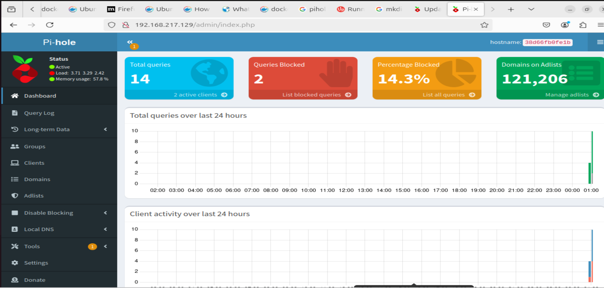

# Arch Linux Project
## Pre-install
- Download Arch Linux ISO
- Create VM with 2 cores, 2-3GB RAM, 32GB HDD
- Mount ISO to VM
- Change .vmx file to boot from EFI append the following line
	firmware = "efi"
- boot vm

## Boot and Prepare Installation Media
check network

	ping archlinux.org

update the system clock

	timedatectl

### Partition the Disk
identify connected disks

	fdisk -l
	# /dev/sda

partition disk with fdisk

	fdisk /dev/sda
	g # sets GPT partition table
	n -> +4G # partition table of size 4 GiB
	t -> 1 # set first partition as EFI
	n # all default options
	w # write changes

format root partition

	mkfs.ext4 /dev/sda2

format efi partition

	mkfs.fat -F32 /dev/sda1

mount file systems

	mount /dev/sda2 /mnt
	mount --mkdir /dev/sda1 /mnt/boot

## Install to Disk & Setup
install essential packages

	pacstrap -K /mnt base linux linux-firmware networkmanager nano man-db man-pages texinfo

generate fstab

	genfstab -U /mnt >> /mnt/etc/fstab

chroot into new filesystem

	arch-chroot /mnt

link timezone 

	ln -sf /usr/share/zoneinfo/America/North_Dakota/Center /etc/localtime
	hwclock --systohc

localize

	nano /etc/locale.gen
	# uncomment en_US.UTF-8
	locale-gen
	echo 'LANG=en_US_UTF-8' > /etc/locale.conf

set hostname

	echo 'tacopls-arch' > /etc/hostname

change root password

	passwd

bootloader GRUB

	pacman -Sy grub efibootmgr
	grub-install --target=x86_64-efi --efi-directory=boot --bootloader-id=GRUB
	grub-mkconfig -o /boot/grub/grub.cfg

exit chroot and reboot

	exit
	reboot

start NetworkManager service

	systemctl enable NetworkManager
	systemctl start NetworkManager

## Post install additions

### install Desktop Environment
install display server

	pacman -Sy xorg-server

install vm-ware tools and drivers

	pacman -Sy open-vm-tools xf86-input-vmmouse xf86-video-vmware

install nvidia

	pacman-Sy nvidia

install plasma

	pacman -Sy plasma kde-applications

install sddm

	pacman -Sy sddm sddm-kcm

enable DE

	systemctl enable sddm
	systemctl start sddm

I made a mistake here. you should add users before starting sddm

add users

	useradd -m Alex
	useradd -m Codi
	useradd -m Justin

	passwd codi # GraceHopper1906
	passwd -e Codi
	passwd Justin # GraceHopper1906
	passwd -e Justin
	passwd Alex

add users to sudo group and make the sudo group have sudo

	pacman -S sudo vi
	visudo /etc/sudoers # uncomment %sudo ALL=(ALL) ALL
	
	groupadd sudo
	usermod -aG sudo Alex
	usermod -aG sudo Codi
	usermod -aG sudo Justin

install different shell

	pacman -Sy zsh
	zsh 
	usermod --shell /bin/zsh Alex

Install oh-my-zsh

	sh -c "$(curl -fsSL https://raw.githubusercontent.com/ohmyzsh/ohmyzsh/master/tools/install.sh)"
	# Step through installer

originally I tried to install Prezto but it was more confusing

add ssh

	 sudo pacman -Sy openssh

add browser

	pacman -Sy firefox

i tried to load into plasma and it didnt work :(

changes made:

	pacman -Rs plasma plasma-desktop plasma-workspace kde-applications

	pacman -Sy lxqt breeze-icons

add aliases

	nano ~/.zshrc
	# append alias c='clear', alias h='history', alias ..='cd ..'
	source ~/.zshrc

# Docker and Pi-hole Project
 ## Install docker
	touch dockerScript
	nano dockerSript
	# paste script below
	# Add Docker's official GPG key:
	sudo apt-get update
	sudo apt-get install ca-certificates curl
	sudo install -m 0755 -d /etc/apt/keyrings
		sudo curl -fsSL https://download.docker.com/linux/ubuntu/gpg -o /etc/apt/keyrings/docker.asc
	sudo chmod a+r /etc/apt/keyrings/docker.asc

	# Add the repository to Apt sources:
	echo \ 
	"deb [arch=$(dpkg --print-architecture) signed-by=/etc/apt/keyrings/docker.asc] https://download.docker.com/linux/ubuntu \
	  $(. /etc/os-release && echo "$VERSION_CODENAME") stable" | \
	  sudo tee /etc/apt/sources.list.d/docker.list > /dev/null
	sudo apt-get update

#### Install Docker Packages
	sudo apt-get install docker-ce docker-ce-cli containerd.io docker-buildx-plugin docker-compose-plugin

#### Verify Installation
	sudo docker run hello-world

## Install Pi-hole
	mkdir pihole
	nano docker-compose.yml
	# paste the docker-compose.yml.example from the pi-hole github

my port 53 wasnt open so you you will also need to clear it 
https://discourse.pi-hole.net/t/update-what-to-do-if-port-53-is-already-in-use/52033
clear port 53
	sudo nano /etc/systemd/resolved.conf
	# uncomment DNSStubListener and change it to no
	sudo service systemd-resolved restart

	docker compose up -d
	
get your ip address with hostname -I
go to https://YOUR_IP/admin but replace YOUR_IP with your ip address

